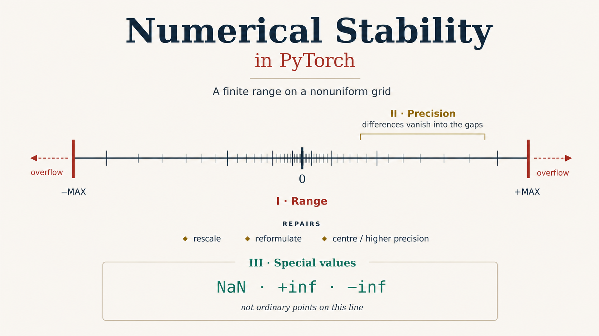
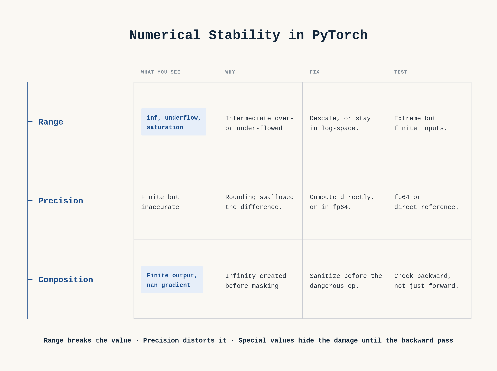

Here is a `softmax` — the most ordinary operation in deep learning, written exactly as the definition says — and here it is returning `nan` on inputs that are perfectly ordinary logits:

```{python}
import torch
def softmax_textbook(x):
    e = torch.exp(x)
    return e / e.sum(-1, keepdim=True)

print(softmax_textbook(torch.tensor([1000., 1001., 1002.])).tolist())
```

Nothing is wrong with the math. The formula is correct in the real numbers, the inputs are three ordinary logits, and yet the answer is garbage — three `nan`s where three probabilities should be. The reason is the single fact this entire post is built around, so it's worth stating before anything else:

> A floating-point number can only represent values inside a finite **window**. `fp32` tops out around $3.4 \times 10^{38}$; `fp16`, still common in mixed-precision workloads, tops out at just `65504`. Step outside the window and arithmetic doesn't wrap or warn — it saturates to `inf`, or collapses to exactly `0`. And `exp` walks you outside that window terrifyingly fast: `exp(89)` already overflows `fp32`, and `exp(12)` overflows `fp16`.

`exp(1002)` is `inf`. Then `inf / inf` is `nan`, and the whole vector is poisoned. That's the bug above, and once you see the window, the fix writes itself: before calling `exp`, *shift the numbers back inside the window*. That move — pull the values into the safe range before the dangerous operation, in a way that provably doesn't change the mathematical answer — is the dominant theme of this post, and five of its six cases are variations on it. But keeping numbers *inside* the window is not the whole story of numerical stability, and the sixth case is the reason: sometimes every intermediate is perfectly representable and you still get a catastrophically wrong answer, because *subtracting two nearly-equal numbers destroys the precision of the result*. That second failure mode — cancellation — comes from the same finite-precision world but has nothing to do with the window's edges, and it produces the most dangerous bug in the post.

> **TL;DR** — Floats live in a finite window (`fp16` overflows above `exp(11)`, `fp32` above `exp(89)`), and outside it arithmetic saturates to `inf` or collapses to `0` silently. The softmax max-trick, `logsumexp`, `log_softmax`, the two-branch sigmoid, and logit-based cross-entropy are all the *same idea*: rewrite the computation so intermediate values stay inside the window without changing the real-valued result. Then there's a bug from the same world in different clothing — the standard vectorized distance formula subtracts two nearly-equal large numbers and returns **negative squared distances**, which `sqrt` turns into `nan` — and which corrupts distance *magnitudes* even where the sign survives. 

# Part I — Range: when a value leaves the window

## The window, and why exp is so dangerous near its edge

Before the fixes, look at the window itself, because its size is the whole reason `fp16` is scary and `bf16` is not:

```{python}
import math
for dt, name in [(torch.float16, 'fp16'), (torch.bfloat16, 'bf16'), (torch.float32, 'fp32')]:
    fi = torch.finfo(dt)
    print(f"{name}: largest value ~{fi.max:.2e}  |  exp(x) overflow boundary near x = {math.log(fi.max):.1f}")
```

Read the `fp16` row and feel the danger: an activation of `12` — a completely unremarkable value — overflows `exp` in half precision. This is also, in one line, why **`bf16` is usually the safer choice** for training: it has the *same exponent range as `fp32`* (same overflow threshold, `88.7`), so it's far less prone to the range-related overflow and underflow failures that plague `fp16` — at the cost of fewer precision bits, which makes rounding and cancellation *worse*. That trade is why `fp16` typically needs loss-scaling to keep small gradients from underflowing while `bf16` usually doesn't, though stability always remains workload- and hardware-dependent. The through-line for this post: range failures dominate anything built on exponentials and probabilities, while significand precision dominates the cancellation-sensitive computations we'll meet later — which is why this post needs both halves.

With the window in view, here are the six places you keep your numbers inside it — and the one place the window's *grid spacing*, rather than its edges, is what bites.

## Softmax: shift into the window before you exp

The bug from the opening, and its fix, side by side:

```{python}
def softmax_stable(x):
    e = torch.exp(x - x.max(-1, keepdim=True).values)   # subtract the max: shift into the window
    return e / e.sum(-1, keepdim=True)

logits = torch.tensor([1000., 1001., 1002.])
print("textbook softmax:", softmax_textbook(logits).tolist())
print("stable softmax  :", [round(v, 6) for v in softmax_stable(logits).tolist()])
print("torch.softmax   :", [round(v, 6) for v in torch.softmax(logits, -1).tolist()])
torch.testing.assert_close(softmax_stable(logits), torch.softmax(logits, -1))
```

The same trick also rescues the *other* edge of the window, which people forget exists — very negative inputs, where the failure looks identical but the cause is the opposite:

```{python}
def softmax_naive(x):
    e = torch.exp(x)
    return e / e.sum(-1, keepdim=True)

logits = torch.tensor([-1000., -1001., -1002.])
print("naive softmax :", softmax_naive(logits).tolist(), " <- exp underflows to 0, then 0/0")
print("stable softmax:", [round(v, 6) for v in softmax_stable(logits).tolist()])
```

Subtracting the max fixes both, because it maps the largest logit to exactly 0 and every other to something ≤ 0. **The largest term is always exactly 1**, so the denominator can never underflow to zero, and nothing can overflow. This argument holds for a **nonempty row of finite logits**. A row containing `+inf` gives `inf - inf = nan`; a row that is entirely `-inf` (every position masked) gives `0/0`; a `nan` anywhere poisons the max. Those aren't hypothetical — the fully-masked row is a whole section below.

### Why the max trick is exact — and where "exact" stops being true

Softmax is **shift-invariant**. For any constant `c`:

$$\frac{e^{x_i - c}}{\sum_j e^{x_j - c}} = \frac{e^{-c}\,e^{x_i}}{e^{-c}\sum_j e^{x_j}} = \frac{e^{x_i}}{\sum_j e^{x_j}}$$

The `e^{-c}` cancels. This is not an approximation; it's an identity. So why subtract the *max* specifically, rather than the mean, or 100, or anything convenient?

Because shift-invariance holds in ℝ, and we are not in ℝ:

```{python}
torch.manual_seed(0)
x = torch.randn(1000) * 5
ref = torch.softmax(x, -1)

for c in [0., 1e2, 1e3, 1e4, 1e5]:
    got = torch.softmax(x + c, -1)
    print(f"c = {c:>8.0f} : max abs diff = {(got - ref).abs().max().item():.3e}"
          f"   allclose? {torch.allclose(got, ref, atol=1e-7)}")
```

Adding a large `c` destroys the precision of `x` **itself** — fp32 holds ~7 significant digits, so `100000.0 + 0.001` rounds to `100000.0` and the information in the low bits of your logits is simply gone. The mathematical identity survives; the float doesn't.

So the max is not an arbitrary choice among many valid shifts. Other shifts *can* keep you safe — any shift that maps the logits below the overflow threshold without underflowing the denominator would do — but the max is the **canonical** one because it buys two guarantees at once: every shifted logit is non-positive (so no exponential can overflow) and at least one is exactly zero (so the denominator is ≥ 1 and cannot underflow). It also doesn't push the whole vector further below the largest entry than necessary. That's a real argument for preferring it — though not a proof that it universally minimizes floating-point error, which would need more than this hand-waving. The best shift, not the only workable one, and a satisfying amount of design packed into one `.max()` call.

## Staying in the window in log-space: why `log(softmax(x))` fails

Softmax lives inside the window now. But the moment you take the *log* of a softmax — which you do constantly, because log-probabilities are what losses are built from — you can fall out of it again, from the other direction: not by overflowing to `inf`, but by underflowing to exactly `0` and then taking `log(0) = -inf`. The fix is the same philosophy — never leave the window — applied in log-space.

```{python}
import torch.nn.functional as F
logits = torch.tensor([0., -50., -100., -800.])

p = torch.softmax(logits, -1)
print("softmax(x)      :", p.tolist())
print("log(softmax(x)) :", torch.log(p).tolist())
print("F.log_softmax(x):", F.log_softmax(logits, -1).tolist())
```

Two failures in one line, and they're different failures.

At `-100`, the probability is `3.78e-44` — a **subnormal** float, right at the edge of fp32's range, where precision has already degraded. `log` of it gives `-99.983`, not `-100`. We've lost three digits.

At `-800`, the probability underflowed to **exactly zero**. `log(0) = -inf`. The information is not degraded — it is *destroyed*. No amount of downstream care recovers it, and if that `-inf` contributes to a loss it can produce an infinite loss or non-finite gradients, depending on what the surrounding operation does with it.

`log_softmax` never makes this mistake because it never materializes the probability:

$$\log \text{softmax}(x)_i = x_i - \log\sum_j e^{x_j} = x_i - \text{logsumexp}(x)$$

It computes the log directly, in log-space, staying in the range where fp32 is comfortable. Which brings us to the function everything above is secretly built on:

```{python}
x = torch.tensor([1000., 1001., 1002.])
m = x.max()
manual = m + torch.log(torch.exp(x - m).sum())        # the logsumexp identity

print(f"naive log(sum(exp(x)))       = {torch.log(torch.exp(x).sum()).item()}")
print(f"m + log(sum(exp(x - m)))     = {manual.item():.6f}")
print(f"torch.logsumexp(x, -1)       = {torch.logsumexp(x, -1).item():.6f}")
torch.testing.assert_close(manual, torch.logsumexp(x, -1))
```

$$\log\sum_j e^{x_j} = m + \log\sum_j e^{x_j - m}, \quad m = \max_j x_j$$

That identity is the load-bearing beam of this entire subject. It's the same trick FlashAttention's online softmax generalizes to a streaming setting, and it's why `torch.logsumexp` exists as a primitive at all.

## Sigmoid: two formulas, one for each side of the window

The same window governs `sigmoid`, and the fix here is a small twist on "shift into the window": use a *different algebraic form* on each side, each one chosen so `exp` only ever sees a safe argument.

$$\sigma(x) = \frac{1}{1 + e^{-x}}$$

Perfectly fine — for `x ≥ 0`. For `x` very negative, `e^{-x}` explodes:

```{python}
import math

def sigmoid_naive(x):
    return 1 / (1 + torch.exp(-x))

xs = torch.tensor([-1000., -5., 0., 5., 1000.], requires_grad=True)
out = sigmoid_naive(xs)
out.sum().backward()

print("naive forward :", out.detach().tolist())
print("naive gradient:", xs.grad.tolist())
```

**Look carefully at those two lines, because the failure is not where you'd expect.** The *forward* pass is correct — `exp(1000) = inf`, then `1/(1+inf) = 0`, which is the right limit. 

The **gradient** is `nan`. The derivative of the naive form involves the same `inf` intermediate, and `inf/inf² ` is `nan`. So your loss curve looks healthy, your forward values are right, and your weights quietly fill with `nan` from the backward pass. This is the recurring lesson of the whole post: **checking the forward value is not checking numerical stability.**

The repair is to never let `exp` see a positive argument in the first place, by using a different — algebraically identical — form on each side of zero:

$$\sigma(x) = \frac{1}{1 + e^{-x}} \quad (x \ge 0), \qquad \sigma(x) = \frac{e^{x}}{1 + e^{x}} \quad (x < 0)$$

Both are the same function; each branch keeps its exponential's argument non-positive, so the exponential lands in `(0, 1]`, the denominator lands in `[1, 2]`, and for finite inputs no intermediate can overflow in any precision. In practice you should just call `torch.sigmoid`, which is finite in both directions:

```{python}
xs2 = torch.tensor([-1000., -5., 0., 5., 1000.], requires_grad=True)
torch.sigmoid(xs2).sum().backward()
print("torch.sigmoid gradient:", xs2.grad.tolist())
```

# Part II — Precision: when the digits cancel

## The grid, not the edge: negative squared distances

Every failure so far came from the *edges* of the window — values too big or too small to represent. This one is different, and it's my favourite, because there's no `exp` anywhere and it comes from the window's *grid spacing* instead of its edges: floats near a large value are spaced far apart, so subtracting two large nearly-equal numbers throws away all the meaningful digits. It can silently corrupt retrieval, geometry, and loss computations.

The textbook vectorized distance uses the expansion $\|a-b\|^2 = \|a\|^2 + \|b\|^2 - 2a^\top b$, which lets you compute an entire `(N, N)` distance matrix with one matmul instead of materializing an `(N, N, D)` intermediate. This is a common vectorized formulation because it replaces an (N,N,D) difference tensor with a matrix multiplication.

```{python}
torch.manual_seed(1)
D = 128
X = torch.randn(500, D) * 10 + 100        # not centered — that's the trigger

def dist_expanded(X):
    sq = (X ** 2).sum(-1)
    return sq[:, None] + sq[None, :] - 2.0 * (X @ X.T)

d = dist_expanded(X)
print(f"negative squared distances : {(d < 0).sum().item()} of {d.numel()}")
print(f"most negative value        : {d.min().item():.4f}")
print(f"d(x, x) should be 0; worst : {d.diagonal().abs().max().item():.4f}")
print(f"NaNs after sqrt            : {torch.sqrt(d).isnan().sum().item()}")
```

A *squared* distance. Negative. And `sqrt` of it is `NaN`, which then propagates into your loss, your gradients, and your weekend.

**Where do the negatives live?** 

```{python}
eye = torch.eye(500, dtype=torch.bool)
neg = d < 0
print(f"negatives ON the diagonal : {(neg &  eye).sum().item()} (of 500 diagonal entries)")
print(f"negatives OFF the diagonal: {(neg & ~eye).sum().item()}")
```

**All** of them are on the diagonal — *for this data*. Self-distances are the *most vulnerable* entries: `d(x,x)` is the one place whose true value is exactly zero, so even a tiny absolute error is enormous relative to the result, and roughly half the time it lands on the negative side. 

The mechanism is **catastrophic cancellation**. With `‖x‖² ≈ 1.29e6` and `2x·x ≈ 1.29e6`, you are subtracting two large, nearly equal numbers to get something near 0. fp32 carries ~7 significant digits, so the top ~7 digits cancel exactly and what survives is *rounding noise from the inputs*, amplified into the output. The absolute error here is `±1.5` — which is nothing next to `1.29e6`, and catastrophic next to `0`.

### Does centering fix it?

I thought so. It doesn't — and this is the more interesting result:

```{python}
Xc = X - X.mean(0, keepdim=True)
dc = dist_expanded(Xc)
d_direct  = ((X[:, None, :]  - X[None, :, :])  ** 2).sum(-1)
dc_direct = ((Xc[:, None, :] - Xc[None, :, :]) ** 2).sum(-1)

print(f"uncentered: ||x||^2 ~ {(X**2).sum(-1).mean():.0f} | max error {(d - d_direct).abs().max():.4f}")
print(f"centered  : ||x||^2 ~ {(Xc**2).sum(-1).mean():.0f} | max error {(dc - dc_direct).abs().max():.4f}")
print(f"\ncentered negatives: {(dc < 0).sum().item()} — still all on the diagonal")
```

Centering shrinks the error, which genuinely matters for the off-diagonal entries. But shrinking the error scale does not *guarantee* the diagonal comes out non-negative, because its true value is exactly zero and the remaining noise still has a sign. Scaling arguments help; they don't resolve structural ones.

### And it is not only the diagonal

Here's the deterministic counterexample that kills the "just fix the diagonal" mental model. Two *distinct* points, far from the origin, separated by 0.01 in one coordinate:

```{python}
close = torch.full((2, 16), 100_000.0)
close[1, 0] += 0.01                                # a genuinely different point

d_dir = ((close[0] - close[1]) ** 2).sum().item()  # direct subtraction
d_exp = dist_expanded(close)[0, 1].item()          # expanded formula

print(f"direct   : {d_dir:.6e}")
print(f"expanded : {d_exp:+.5e}")
```

The true squared distance is about `6e-5`. The expanded formula reports **negative thirty-two thousand** — an off-diagonal entry, between two different points. The mechanism is the same cancellation, just fed bigger numbers: `‖x‖² ≈ 1.6×10¹¹`, and fp32's spacing between representable values at `3.2×10¹¹` is about `3.3×10⁴`. The entire answer lives *below one unit in the last place* of the intermediates. The `-32768` isn't even an error estimate — it's literally one grid step of the float lattice.

Two smaller cuts from the same experiment, both worth a beat:

- Notice `direct` says `6.1e-05`, not the `1e-04` you'd compute by hand from `0.01²`. That's because **the perturbation itself got rounded on storage**. Try `+= 0.001` and the two points become *bitwise identical* — your "distinct" test case silently collapses to a duplicate.
- This is why "near-duplicate detection at large offsets" is close to the worst-case workload for the expanded formula — a failure mode that can matter in near-duplicate detection and retrieval pipelines, especially when unnormalised features carry large common offsets.

### The fixes, in order

```{python}
raw     = dist_expanded(X)
clamped = raw.clamp_min(0)            # out-of-place: keep `raw` around to inspect
print("1. clamp   :", f"{(clamped < 0).sum().item()} negatives, "
      f"{clamped.sqrt().isnan().sum().item()} NaNs")
print("2. cdist   :", f"{(torch.cdist(X, X) < 0).sum().item()} negatives, "
      f"{torch.cdist(X, X).isnan().sum().item()} NaNs")
print("3. float64 :", f"{(dist_expanded(X.double()) < 0).sum().item()} negatives, "
      f"worst diagonal {dist_expanded(X.double()).diagonal().min().item():.2e}")
```

- **`.clamp_min(0)`** — the one-line patch, when your application's contract needs a real non-negative result. *Small* negatives from expected rounding can be clamped before `sqrt`; *large* negatives (like our `-32768`) should be read as evidence that the formulation or precision is inadequate, not quietly clamped away. Either way, be honest about what clamp buys: it restores the **invariant** (squared distances non-negative, `sqrt` won't `nan`), not the **accuracy**. If near-duplicate geometry is what you care about, use the direct form (chunked over blocks if memory forces it) or fp64 for that region.
- **`torch.cdist`** — the maintained high-level starting point, *provided you check which compute mode you're actually getting on numerically awkward data*. Do not file it under "handled." `cdist` chooses between a direct implementation and the same expanded-matmul form we just indicted, based on its `compute_mode` argument — and the default heuristic switches to the matmul path once either input has more than 25 points. On our own counterexample that is not a subtle difference:

```{python}
import platform
print(f"[python {platform.python_version()} | torch {torch.__version__} | "
      f"{'cuda' if torch.cuda.is_available() else 'cpu'}]  <- these exact values are build-specific\n")

close = torch.full((2, 16), 100_000.0)
close[1, 0] += 0.01
direct = ((close[0] - close[1]) ** 2).sum().sqrt()

# note: 0.0078 is the distance between the STORED fp32 values — the requested +0.01
# increment is itself rounded on storage at this magnitude (see the counterexample above).
print(f"direct distance                      : {direct.item():.6f}")
for mode in ["use_mm_for_euclid_dist_if_necessary",
             "donot_use_mm_for_euclid_dist",
             "use_mm_for_euclid_dist"]:
    d = torch.cdist(close, close, compute_mode=mode)[0, 1]
    print(f"cdist [{mode:35s}]: {d.item():.6f}")
```

If you take one thing from this section: **when you use the expanded form, check the scale of the negatives before you clamp.** Small ones are ordinary rounding and `clamp_min(0)` before `sqrt` is a reasonable repair; large ones — like our `-32768` — are telling you the formulation or the precision is wrong for this data, and clamping them is hiding the evidence rather than fixing the bug.

# Part III — Special values: the infinities you introduce

## A different failure: `0 × inf = nan` and unsafe masking

```{python}
data = torch.tensor([1., 2., float('inf'), 4.])
mask = torch.tensor([True, True, False, True])       # mask OUT the inf

mul   = (data * data * mask.float()).sum()
where = torch.where(mask, data * data, torch.zeros_like(data)).sum()

print(f"multiply-by-mask : {mul.item()}")
print(f"torch.where      : {where.item()}")
```

You masked the `inf` out. It poisoned the sum anyway, because `inf × 0 = nan` and `nan + anything = nan`.

`torch.where` **selects** — the discarded value never enters the *sum*. But before you file this under "solved," here's the part that most treatments (including an earlier draft of this one) stop short of:

### `torch.where` is eager, and the backward pass knows it

`where` is a tensor selector, not control flow. By the time it is called, the tensors supplied as its two branches have already been computed. In the forward pass that was fine — `inf² = inf` is a legal value being discarded. Watch the backward:

```{python}
data = torch.tensor([1., 2., float('inf'), 4.], requires_grad=True)
mask = torch.tensor([True, True, False, True])

loss = torch.where(mask, data * data, torch.zeros_like(data)).sum()
loss.backward()
print("forward :", loss.item())
print("gradient:", data.grad.tolist())
```

**Finite forward, NaN gradient.** The chain rule for the masked slot multiplies the incoming gradient (0, correctly, from `where`) by the local derivative of the square (`2 · data = inf`) — and `0 × inf = nan` is back, one level down, where your loss curve looks perfectly healthy and your weights quietly rot. This is a long-standing, well-documented autograd sharp edge (search "torch.where NaN gradient").

The genuinely safe pattern: **sanitize the input *before* the dangerous op**, not the output after —

```{python}
data2 = torch.tensor([1., 2., float('inf'), 4.], requires_grad=True)
safe  = torch.where(mask, data2, torch.zeros_like(data2))   # inf never enters the square
loss2 = (safe * safe).sum()
loss2.backward()
print("forward :", loss2.item())
print("gradient:", data2.grad.tolist())
assert torch.isfinite(data2.grad).all()      # the whole point of rung 3
```

So the full ladder, worst to best:

1. `(x*x*mask).sum()` — **forward NaN** (`0 × inf` in the sum).
2. `where(mask, x*x, 0).sum()` — forward fine, **backward NaN** (`0 × inf` in the chain rule).
3. `where(mask, x, 0)` **then** square — forward fine, backward fine. The garbage value never touches an op whose derivative can amplify it.

## When the whole row is masked: softmax over nothing

```{python}
torch.manual_seed(0)
scores  = torch.randn(1, 4)
allmask = torch.ones(1, 4, dtype=torch.bool)         # every key masked

print("with -inf:", torch.softmax(scores.masked_fill(allmask, float('-inf')), -1).tolist())
print("with -1e9:", [round(v, 4) for v in
                     torch.softmax(scores.masked_fill(allmask, -1e9), -1)[0].tolist()])
```

Every score is `-inf` → every `exp` is `0` → the denominator is `0` → `0/0 = nan`.

"But a row is never fully masked!" It is: a zero-length sequence that slipped through your collate function, a query attending only to a padded region, a document with all tokens filtered. It happens in production and it happens at 3am.

### And `-1e9` is not the fix — it's an fp32 habit

The classic remedy — BERT-era code is full of it — is a large finite negative like `-1e9`. Now put your model in half precision, where the maximum representable magnitude is **65,504**:

```{python}
#| error: true
scores16 = torch.randn(1, 4, dtype=torch.float16)
scores16.masked_fill(allmask, -1e9)
```

That's the *lucky* failure — a loud one. The additive-mask idiom fails silently:

```{python}
masked_add = scores16 + (-1e9) * allmask.half()      # -1e9 overflows fp16 to -inf
print("additive -1e9 in fp16:", masked_add.tolist())
print("softmax of that      :", torch.softmax(masked_add, -1).tolist())
```

Your carefully chosen finite sentinel round-trips through fp16 and comes out as the exact `-inf` you were avoiding. The dtype-aware fix is one call:

```{python}
neg = torch.finfo(scores16.dtype).min                # -65504.0 in fp16, -3.4e38 in fp32
print(torch.softmax(scores16.masked_fill(allmask, neg), -1).tolist())
```

One step further: the uniform row is a patch, not a solution. A fully masked query now assigns equal probability to positions explicitly marked invalid, so its output becomes an arbitrary average of their value vectors. That may be acceptable only if the row is guaranteed to be discarded before any downstream computation. Otherwise, the implementation has merely replaced a loud `NaN` with a finite but semantically invalid result—a quiet failure that is much harder to detect.



## What to carry away

Floating-point numbers live in a finite window, and stepping outside it doesn't raise — it may saturate to `inf` or collapse to `0`, and your correct-on-paper formula returns `nan`. Most of the standard stability techniques are one move against that fact, with cancellation as the separate second problem:

- **Softmax, `logsumexp`, `log_softmax`, the two-branch sigmoid, logit-based cross-entropy** are all the same idea — rewrite the computation so intermediate values stay inside the window, in a way that provably doesn't change the real-valued answer. Subtract the max; work in log-space; pick the algebraic form whose `exp` argument is safe. The stable version is never a hack bolted onto the math; it *is* the math, done carefully before converting to floats.
- **`bf16` is usually the safer training dtype** for exactly this reason: its `fp32`-like exponent range makes range-related overflow and underflow far less likely than in `fp16`, while its smaller significand can make rounding and cancellation worse. Loss scaling is usually less central for `bf16`, but the right dtype stays workload- and hardware-dependent.
- **The distance bug is the window's grid, not its edge** — subtracting two large nearly-equal numbers destroys precision and returns negative squared distances, which `sqrt` turns into `nan`. It corrupts distance *magnitudes*, and can disturb rankings when the error approaches the gap between neighbours; in the experiment here the top-5 sets happened to survive, which is a fact about that data, not a guarantee. Clamping restores the invariant, not the accuracy.
- **`0 × inf = nan`** means masking by multiplication is unsafe, and `torch.where` selects between *already-evaluated* branches — it doesn't prevent unsafe arithmetic in the branch it later discards, so if gradients flow, sanitize the *input* before the dangerous op (the order is: sanitize → operate → reduce).

## References

- [What Every Computer Scientist Should Know About Floating-Point Arithmetic](https://docs.oracle.com/cd/E19957-01/806-3568/ncg_goldberg.html) — Goldberg, 1991. Still the source. Read §1 on cancellation and you'll never write an expanded-distance formula unguarded again.
- [`torch.logsumexp`](https://pytorch.org/docs/stable/generated/torch.logsumexp.html), [`torch.cdist`](https://pytorch.org/docs/stable/generated/torch.cdist.html) — note `cdist`'s `compute_mode` argument.
- Milakov & Gimelshein, [*Online normalizer calculation for softmax*](https://arxiv.org/abs/1805.02867), 2018 — the streaming generalization of the max trick, and the mathematical core of FlashAttention.
- [PyTorch: automatic mixed precision](https://pytorch.org/docs/stable/amp.html) — where the fp16 range limit becomes a loss-scaler.
- [PyTorch: numerical accuracy notes](https://pytorch.org/docs/stable/notes/numerical_accuracy.html) — the official fine print on reduced-precision reductions, batched-op variance, and why bitwise reproducibility across devices was never promised to you.
