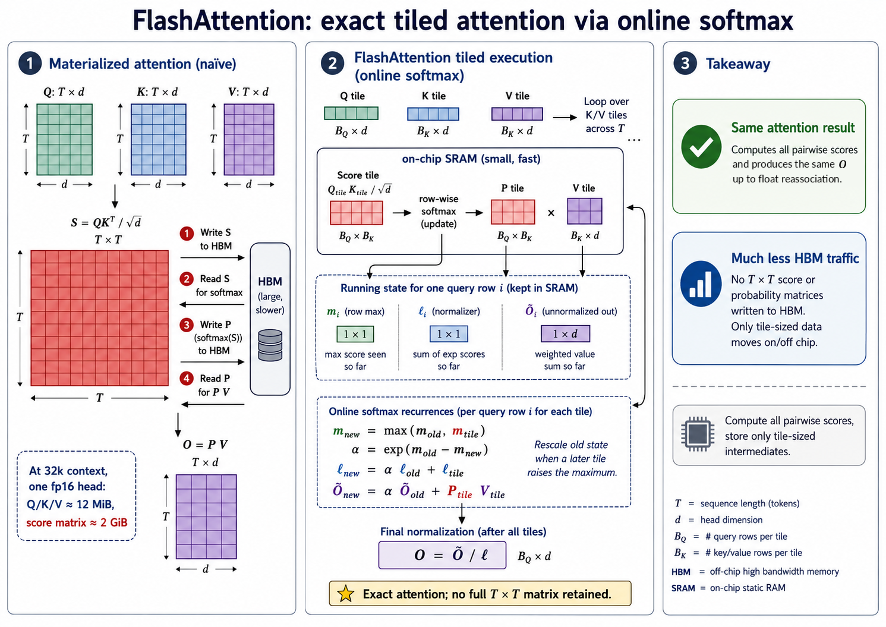

Long context has never had a single obstacle — training data, positional extrapolation, quadratic compute and KV-cache traffic all push back. But for years one of them was blunter than the rest, and it was a storage problem rather than a modelling one: a conventional attention implementation builds one number for every query–key pair, so its scratch space grows with the **square** of the input length. Double the context and you quadruple it.

FlashAttention removed that wall — not by approximating the attention function, but by noticing that the enormous thing in the middle never actually needs to exist.

This post is about what that thing is, why it appears to be unavoidable, and the single mathematical identity that makes it avoidable.

> **TL;DR** — Attention computes a score for every (query, key) pair, giving a `T×T` table that gets used once and discarded. It has to be built because softmax needs the sum over an entire row before it can normalize any single entry — a global operation that seems to demand having the whole row on hand. *Online softmax* dissolves that: keep a running maximum and a running sum, and **when a later block raises the maximum, rescale what you've already accumulated into the new reference frame**. FlashAttention applies that same rescaling to the *output* as well, which is what turns a softmax trick into an attention algorithm. Below: a tiled implementation verified against a float64 reference, and why the forward pass is only half of what FlashAttention actually does.

## What attention computes, in one page

A quick self-contained recap, so nothing below rests on remembering the [attention post](../../../architectures/attention/01-attention-from-scratch.qmd).

Attention is a lookup. Each position in a sequence produces three vectors:

- a **query** — what this position is looking for;
- a **key** — what this position offers to others looking for something;
- a **value** — what this position actually contributes if selected.

For each query, you compare it against every key, turn those comparisons into weights that sum to one, and return the correspondingly weighted blend of the values:

$$\text{Attention}(Q, K, V) = \underbrace{\text{softmax}\!\left(\tfrac{QK^\top}{\sqrt{d}}\right)}_{\text{the } T\times T \text{ table}} V$$

The piece in the brace is the problem. $QK^\top$ has one entry per (query, key) pair, so for a sequence of length $T$ it's a $T \times T$ matrix — and its size has nothing to do with the size of the vectors that produced it:

```{python}
import torch, math
torch.manual_seed(0)

d = 64                                     # width of each query/key vector

print(f"{'context':>10} {'Q,K,V total':>14} {'score matrix':>15} {'ratio':>8}")
for T in [1024, 8192, 32768]:
    inputs = 3 * T * d * 2 / 2**20         # Q, K and V together, in MiB, fp16
    scores = T * T * 2 / 2**20             # the T×T table, same units
    print(f"{T:>10} {inputs:>11.1f} MiB {scores:>12.1f} MiB {scores/inputs:>7.1f}×")
```

At a 32k context, **one fp16 head holds about 12 MiB of Q, K and V, while a materialized implementation creates a 2 GiB score tensor.** That's one head — a real model has dozens per layer and dozens of layers. In training the pressure is worse: the forward path materializes quadratic score *and* probability tensors, and the backward pass needs either those saved intermediates or a way to recompute them. Exactly which tensors survive depends on the framework's lifetime analysis and fusion, so the peak isn't a fixed multiple.

Then it uses the table exactly once, to compute a weighted average, and throws it away.

## A GPU has two memories

A GPU actually has several tiers — registers, an on-chip shared-memory/L1 pool, an L2 cache, and main memory. For this argument two of them carry the whole story, so I'll collapse it to two quite different places to put numbers.

**HBM** (high-bandwidth memory) is the big one — the "40 GB" or "80 GB" in the spec sheet. Despite the name, it is the *slow* one. **SRAM** is on-chip memory sitting right next to the arithmetic units: tiny, and much faster. Using the A100 figures from the FlashAttention paper itself:

```{python}
hbm_capacity,  hbm_bandwidth  = 40e9,        1.5e12    # ~40 GB at ~1.5 TB/s
sram_capacity, sram_bandwidth = 108 * 192e3, 19e12     # 108 SMs × 192 KB, ~19 TB/s

print(f"HBM :  {hbm_capacity/1e9:>6.0f} GB   at {hbm_bandwidth/1e12:>4.1f} TB/s")
print(f"SRAM:  {sram_capacity/1e6:>6.1f} MB   at {sram_bandwidth/1e12:>4.0f} TB/s")
print()
print(f"SRAM is about {sram_bandwidth/hbm_bandwidth:.0f}× faster "
      f"and about {hbm_capacity/sram_capacity:.0f}× smaller")
```

**About thirteen times the bandwidth, at about one two-thousandth of the capacity.** One caveat that matters for the comparison below: that 20.7 MB is a *sum* over 108 SMs, not a single shared scratchpad. No tile ever sees more than one SM's 192 KB. The aggregate is the right number for asking whether the score matrix could live on-chip at all; it is far too generous as a tile budget. For bandwidth-bound kernels that trade matters more than peak arithmetic throughput does — the theme of [the GPU cost model post](../../../fundamentals/tensors/05-how-the-gpu-runs-your-code.qmd), and the reason the FlashAttention paper calls itself *IO-aware*.

Now put the two facts together. A 2 GiB score matrix cannot live in 20 MB of SRAM:

```{python}
score_matrix = 32768 * 32768 * 2                        # 32k context, fp16, bytes
one_row      = 32768 * 2                                # a single query's scores

print(f"full 32k score matrix: {score_matrix/2**30:>8.2f} GiB  "
      f"→ {score_matrix/sram_capacity:>5.0f}× too big for on-chip memory")
print(f"a single row of it:    {one_row/1024:>8.0f} KiB  (fp16; {one_row*2/1024:.0f} KiB if"
      f" accumulated in fp32)")
```

So the matrix has to go to HBM, and it makes the trip four times: the scores are written, read back for the softmax, the probabilities are written, and read back for the product with `V`. **At these shapes the cost of attention is not the multiplications. It is the round trips.**

But notice the second line. A single *row* is four orders of magnitude smaller than the full matrix — small enough that working a piece at a time is clearly the right shape of idea.

Don't read 64 KiB against 192 KB as "so a row fits, problem solved," though. That 192 KB is not a private buffer waiting for one row: registers, the shared-memory/L1 split, the Q/K/V tiles, the score and probability tiles, fp32 accumulators, the row statistics, and enough resident work to keep the SM occupied all compete for it. The real point is weaker and sufficient — **the pieces can be made small enough, and the whole thing cannot.** Which raises the obvious question: what stops us from working in pieces?

## What stops us: softmax needs the whole row

Softmax turns a row of raw scores into weights that sum to one. The numerically stable form, from [the numerical stability post](../../../fundamentals/tensors/04-numerical-stability.qmd), is:

$$\text{softmax}(x)_i = \frac{e^{x_i - m}}{\sum_j e^{x_j - m}}, \qquad m = \max_j x_j$$

The subtraction of $m$ is what stops `exp` overflowing. And now look at what that expression needs: **the maximum over the whole row, and the sum over the whole row.** Both are global.

Try to process a row in blocks and the difficulty is immediate. After the first block you can compute *a* maximum and *a* sum — but they may be the wrong ones, because a later block might contain a larger value, which changes $m$, which invalidates every exponential you already computed.

That is the obstacle, and it looks fatal. It is the reason the natural implementation computes the entire row, stores it, takes the statistics, and only then normalizes.

## The identity: you can fix what you already wrote

The escape is to stop insisting on getting it right the first time.

Suppose you've processed part of a row and are holding two running values: the largest score seen so far, $m$, and the running sum $\ell = \sum e^{x_j - m}$ over that part. A new block arrives containing a larger value, so the maximum must become $m_{\text{new}}$.

Your existing $\ell$ is now measured against the wrong baseline. But fixing it is a *single multiplication*:

$$\sum_j e^{x_j - m_{\text{new}}} \;=\; e^{m - m_{\text{new}}} \sum_j e^{x_j - m}$$

which is true because $e^{x_j - m_{\text{new}}} = e^{x_j - m} \cdot e^{m - m_{\text{new}}}$ and the common factor pulls out of the sum.

Before generalising, watch it happen on four numbers. Suppose the first block of scores is $[1, 2]$ and the second is $[10, 0]$:

```{python}
first_block  = torch.tensor([1., 2.])
second_block = torch.tensor([10., 0.])

# --- after the first block ---
m = first_block.max()                              # 2
l = torch.exp(first_block - m).sum()               # e^-1 + e^0
print(f"after block 1:  max = {m:.0f},  running sum = {l:.4f}")

# --- the second block arrives, and it contains a 10 ---
m_new = torch.maximum(m, second_block.max())       # the baseline must move to 10
alpha = torch.exp(m - m_new)                       # e^(2-10) = e^-8, a tiny number
l = l * alpha + torch.exp(second_block - m_new).sum()
print(f"block 2 raises the max to {m_new:.0f}, so everything so far is scaled by "
      f"e^(2−10) = {alpha:.2e}")
print(f"after block 2:  running sum = {l:.6f}")

# --- the answer we'd have got by doing it all at once ---
all_scores = torch.cat([first_block, second_block])
direct = torch.exp(all_scores - all_scores.max()).sum()
print(f"computed densely in one go: {direct:.6f}")
assert torch.allclose(l, direct)
```

**Nothing about the first block's values changed.** What changed is the coordinate system their exponentials are expressed in — and converting between coordinate systems costs one multiplication, applied to the summary rather than to the elements. That is the entire idea, and everything below is that sentence applied to larger objects.

That factor $e^{m - m_{\text{new}}}$ is the whole trick. Because the maximum only ever grows, the exponent is never positive, so the factor is always in $[0, 1]$ — it shrinks the old contribution to match the new, larger baseline. **You never revisit a single element; you rescale their summary.**

```{python}
def streaming_logsumexp(x, block=7):
    """Compute log(Σ exp(x)) in ONE pass, holding only two numbers.

    The stable dense version traverses the input twice: once to find the
    maximum, once to sum the shifted exponentials. This version traverses it
    once, keeping a running (max, sum) and repairing the sum when the max moves.
    """
    m, l = -float('inf'), 0.0                      # max seen so far; sum so far
    for i in range(0, len(x), block):
        blk = x[i:i + block]
        block_max = blk.max().item()
        if block_max == -float('inf'):
            continue                               # a block of pure -inf adds nothing
        m_new = max(m, block_max)                  # the max may have just grown
        rescale = 0.0 if m == -float('inf') else math.exp(m - m_new)
        l = l * rescale + torch.exp(blk - m_new).sum().item()
        m = m_new
    return -float('inf') if l == 0.0 else m + math.log(l)

assert streaming_logsumexp(torch.full((4,), -torch.inf)) == -float('inf')

x = torch.randn(1000) * 10                          # spread out, so the max really moves
print(f"streaming, 7 at a time: {streaming_logsumexp(x):.8f}")
print(f"dense, all at once:     {torch.logsumexp(x, 0).item():.8f}")
assert abs(streaming_logsumexp(x) - torch.logsumexp(x, 0).item()) < 1e-4
print("agree — one traversal, constant-size state  ✓")
```

Two guards earn their place. The first rescale factor has to be *forced* to zero rather than computed, because starting from `m = -inf` gives `-inf - (-inf)`, which is `NaN`. That isn't a contrived input — it is exactly a fully masked row, which this chapter runs into again under causal masking. A block of pure `-inf` contributes nothing and is skipped, and if every block was empty the answer is `-inf` rather than `log(0)`. (This is deliberately written with scalars for readability. On a GPU each `.item()` would force the device to synchronize with the host — a real kernel keeps both statistics on-chip and never brings them back.)

None of this is FlashAttention's. Milakov and Gimelshein published the online normalizer in 2018 for softmax alone, and Rabe and Staats showed in 2021 that exact attention can accumulate the numerator alongside the denominator, so it needs no quadratic storage. **The memory result was already known.** What FlashAttention contributed was turning it into a fast algorithm on real hardware: an IO-aware tiling schedule matched to the memory hierarchy, fused execution that keeps the tile on-chip, and a backward pass that reconstructs the quadratic intermediates instead of storing them.

## From softmax to attention: rescale the output too

Attention doesn't want the weights. It wants $PV$ — the weighted average of the value vectors. So carry a third running quantity alongside the max and the sum: an **unnormalized output accumulator** $O$, corrected by exactly the same factor.

Here's the picture before the algebra. Chop the keys and values into blocks. For each block:

1. Compute the scores of your queries against *this block only* — a small tile, which fits on-chip.
2. See whether the row maximum has grown. If so, rescale your running sum **and your running output** by $e^{m_{\text{old}} - m_{\text{new}}}$.
3. Add this block's contribution to both.
4. Discard the tile. You will never need it again.

After the last block, divide the accumulated output by the accumulated sum, once. Formally:

$$m_{\text{new}} = \max\big(m,\ \text{rowmax}(S)\big), \qquad \alpha = e^{m - m_{\text{new}}}$$
$$P = e^{S - m_{\text{new}}}, \qquad \ell \leftarrow \alpha\,\ell + \text{rowsum}(P), \qquad O \leftarrow \alpha\,O + P V$$

Two details worth noticing before the code. **The maximum is replaced, not rescaled** — only the two accumulators live in a reference frame that has to be shifted. And **deferring the final division** to the very end is a real refinement: FlashAttention-1 kept a normalized output through every tile, and [FlashAttention-2](https://arxiv.org/abs/2307.08691) reformulated the loop to avoid that per-tile division, which is one of several ways it cut non-matmul work.


## Build it

::: {.callout-note}
## What this implementation is for

A readable specification of the forward pass, not a production kernel. One attention head, rank-2 tensors, optional causal masking, no dropout or attention bias. Half-precision inputs are converted to fp32 tiles and the whole recurrence runs in fp32 — reference arithmetic, not the mixed-precision matmul-with-fp32-accumulate a real kernel performs. It does **not** implement FlashAttention's memory-efficient backward pass, and being a Python double loop it is far slower than either the fused kernel or the naive implementation. Its job is to let you check the recurrence against a reference and see exactly where the rescale goes.
:::

The input contract first, kept separate so the algorithm itself reads cleanly:

```{python}
def _check(Q, K, V, block_q, block_k):
    """Validate shapes and dtypes. Separated from the algorithm on purpose —
    the interesting part is short, and shouldn't be buried in guard clauses."""
    if Q.ndim != 2 or K.ndim != 2 or V.ndim != 2:
        raise ValueError("Q, K, V must be rank 2 (single head)")
    if not all(t.is_floating_point() for t in (Q, K, V)):
        raise TypeError("Q, K, V must be floating point")
    if not (Q.dtype == K.dtype == V.dtype):
        raise TypeError(f"dtypes differ: {Q.dtype}, {K.dtype}, {V.dtype}")
    if K.shape[1] != Q.shape[1]:
        raise ValueError(f"Q and K widths differ: {Q.shape[1]} vs {K.shape[1]}")
    if V.shape[0] != K.shape[0]:
        raise ValueError(f"K and V lengths differ: {K.shape[0]} vs {V.shape[0]}")
    if Q.shape[1] == 0:
        raise ValueError("query/key width must be positive")
    if not (Q.device == K.device == V.device):
        raise ValueError("Q, K, V must be on the same device")
    if block_q < 1 or block_k < 1:
        raise ValueError("block sizes must be positive")
```

Now the algorithm. Every line that isn't bookkeeping is commented:

```{python}
def flash_attention(Q, K, V, causal=False, block_q=32, block_k=32):
    """Tiled attention with online softmax.

    Q: (Tq, d), K: (Tk, d), V: (Tk, dv)  ->  O: (Tq, dv), and L: (Tq,), the
    per-row logsumexp that a real backward pass needs.

    Returns O and L in the ACCUMULATION dtype, not the input dtype: float32 for
    fp16/bf16/fp32 inputs, float64 for float64 inputs.

    Never constructs a (Tq, Tk) tensor. The largest query-by-key object it
    builds is one (block_q, block_k) tile.
    """
    _check(Q, K, V, block_q, block_k)
    Tq, d = Q.shape
    Tk, dv = K.shape[0], V.shape[1]        # note: value width may differ from d
    dev = Q.device                          # every allocation below inherits this;
    acc = torch.float64 if Q.dtype == torch.float64 else torch.float32
    scale = 1.0 / math.sqrt(d)

    if Tk == 0:                             # no keys at all: attend to nothing
        return (torch.zeros(Tq, dv, device=dev, dtype=acc),
                torch.full((Tq,), -torch.inf, device=dev, dtype=acc))

    O = torch.zeros(Tq, dv, device=dev, dtype=acc)
    L = torch.zeros(Tq, device=dev, dtype=acc)

    for i in range(0, Tq, block_q):                      # outer loop: query blocks
        n_q = min(block_q, Tq - i)                       # last block may be short
        Qi = Q[i:i + n_q].to(acc)

        # The three running quantities. This is the entire state of the algorithm:
        # no matter how long the sequence, it never grows.
        Oi = torch.zeros(n_q, dv, device=dev, dtype=acc) # output so far, UNnormalized
        mi = torch.full((n_q,), -torch.inf, device=dev, dtype=acc)   # largest score so far
        li = torch.zeros(n_q, device=dev, dtype=acc)                 # sum of exp so far

        for j in range(0, Tk, block_k):                  # inner loop: key/value blocks
            if causal and j > i + n_q - 1:
                break        # this block is entirely in the future, and so is every
                             # later one — blocks are visited in increasing order
            n_k = min(block_k, Tk - j)
            Kj, Vj = K[j:j + n_k].to(acc), V[j:j + n_k].to(acc)

            S = (Qi @ Kj.T) * scale                      # the ONLY matrix we build
            if causal:                                   # mask within a straddling block
                q_pos = torch.arange(i, i + n_q, device=dev)[:, None]
                k_pos = torch.arange(j, j + n_k, device=dev)[None, :]
                S = S.masked_fill(k_pos > q_pos, -torch.inf)

            # --- the online softmax update, in four lines ---
            m_new = torch.maximum(mi, S.max(dim=-1).values)   # has the max grown?
            alpha = torch.where(torch.isneginf(mi),            # first block: nothing
                                torch.zeros_like(mi),          # to rescale yet
                                torch.exp(mi - m_new))         # otherwise: the factor
            P = torch.exp(S - m_new[:, None])                  # masked entries → 0
            li = li * alpha + P.sum(dim=-1)                    # rescale, then accumulate
            Oi = Oi * alpha[:, None] + P @ Vj                  # SAME factor, same pattern
            mi = m_new                                          # max is replaced, not scaled

        O[i:i + n_q] = Oi / li[:, None]      # normalize once, after the last block
        L[i:i + n_q] = mi + torch.log(li)
    return O, L
```

**If you remember one thing, remember the two accumulation lines.** `li` and `Oi` receive the identical `alpha`. That symmetry is the algorithm — the denominator and the output are both sums measured against a baseline, so both need the same repair when the baseline moves.

::: {.callout-note}
## Two things this deliberately doesn't do

**Non-square causal alignment.** The mask uses absolute positions from zero, which is *upper-left* alignment — matching what `F.scaled_dot_product_attention` documents for `is_causal=True`. Incremental decoding needs the other convention, with query positions offset by the cache length.

**Arbitrary masks.** The implementation assumes every non-empty query row has at least one valid key, which upper-left causal masking guarantees (query *i* can always see key *i*). Add a padding mask or an arbitrary mask and fully-masked rows become possible — at which point `P = exp(S - m_new)` computes `exp(-inf − (-inf))`, which is **NaN**. That needs an explicit policy, which is the fully-masked-row discussion in [the numerical stability post](../../../fundamentals/tensors/04-numerical-stability.qmd).

**A memory-efficient backward pass.** The returned `L` is what a real backward pass needs, but this function relies on ordinary autograd — which has a consequence large enough that it gets [its own post](02b-what-autograd-saves.qmd).
:::

## Check it

The claim is exactness, so the test compares against attention computed the obvious way — in float64, so the reference isn't itself under suspicion:

```{python}
def exact_attention(Q, K, V, causal=False):
    """Direct attention in float64: build the whole matrix, softmax it, multiply.
    Deliberately a precision above what we're testing."""
    d = Q.shape[-1]
    S = (Q.double() @ K.double().T) / math.sqrt(d)
    if causal:
        future = torch.triu(torch.ones(Q.shape[0], K.shape[0],
                                       dtype=torch.bool, device=Q.device), 1)
        S = S.masked_fill(future, -torch.inf)
    return torch.softmax(S, -1) @ V.double(), torch.logsumexp(S, -1)
```

```{python}
# Many tiny matmuls in a Python loop, so this is dominated by threadpool overhead
# rather than work. Pin to one thread so the render is reproducible.
prev_threads = torch.get_num_threads()
torch.set_num_threads(1)
try:
    worst = 0.0
    for (Tq, Tk, d, dv) in [(64, 64, 16, 16), (100, 100, 32, 32),
                            (128, 96, 64, 24), (37, 53, 8, 11)]:   # dv ≠ d twice
        for causal in ([False, True] if Tq == Tk else [False]):
            for bq, bk in [(32, 32), (16, 64), (7, 13)]:     # 7 and 13 divide nothing
                Q, K, V = torch.randn(Tq, d), torch.randn(Tk, d), torch.randn(Tk, dv)
                O, L = flash_attention(Q, K, V, causal=causal, block_q=bq, block_k=bk)
                Oe, Le = exact_attention(Q, K, V, causal=causal)
                worst = max(worst, (O.double() - Oe).abs().max().item())
                torch.testing.assert_close(O.double(), Oe, atol=1e-5, rtol=1e-5)
                torch.testing.assert_close(L.double(), Le, atol=1e-5, rtol=1e-5)
finally:
    torch.set_num_threads(prev_threads)

print("tiled == dense, across shapes, block sizes and causal settings")
print(f"worst absolute error anywhere: {worst:.2e}")
```

The block sizes 7 and 13 are deliberate: they divide none of the sequence lengths, so the ragged final blocks on both axes get exercised. An implementation that only works when blocks tile evenly is the commonest way to get this subtly wrong. Two shapes also use `dv ≠ d`, since the value width needn't match the key width.

The prose claims upper-left causal alignment, so the test should claim it too — on non-square shapes the sweep above never reaches:

```{python}
import torch.nn.functional as F
for Tq, Tk in [(3, 7), (7, 3), (1, 10), (10, 1)]:
    Q, K, V = torch.randn(Tq, 8), torch.randn(Tk, 8), torch.randn(Tk, 5)
    tiled, _ = flash_attention(Q, K, V, causal=True, block_q=3, block_k=4)
    builtin = F.scaled_dot_product_attention(Q[None, None], K[None, None],
                                             V[None, None], is_causal=True)[0, 0]
    torch.testing.assert_close(tiled.float(), builtin, atol=1e-5, rtol=1e-5)
print("non-square causal matches F.scaled_dot_product_attention(is_causal=True)  ✓")
```

And the contract fails loudly rather than quietly:

```{python}
bad_inputs = [
    ((torch.randn(4, 8), torch.randn(4, 7), torch.randn(4, 8)), "Q/K width mismatch"),
    ((torch.randn(4, 8), torch.randn(4, 8), torch.randn(5, 8)), "K/V length mismatch"),
    ((torch.randn(2, 4, 8), torch.randn(4, 8), torch.randn(4, 8)), "rank-3 input"),
    ((torch.randn(4, 8), torch.randn(4, 8).double(), torch.randn(4, 8)), "mixed dtypes"),
]
for args, why in bad_inputs:
    try:
        flash_attention(*args); print(f"{why}: no error — bad")
    except (ValueError, TypeError) as e:
        print(f"{why:22s} → {type(e).__name__}  ✓")

# An empty key sequence gets a stated policy rather than a NaN.
O_empty, L_empty = flash_attention(torch.randn(3, 4), torch.empty(0, 4), torch.empty(0, 5))
assert torch.equal(O_empty, torch.zeros(3, 5)) and torch.isneginf(L_empty).all()
print(f"{'empty key sequence':22s} → zeros and −inf, by policy  ✓")
```

Exactness against a reference tests the *answer*. There is a second property worth testing, which is about the *method*: unmasked attention, with no position-dependent bias, is invariant to a joint permutation of the key–value pairs. Reorder them together and the result must not move. (Causal attention is not, since the permutation moves keys relative to the mask — which is the mask's whole purpose.) That is a useful thing to check on a blocked implementation specifically, because processing order and block boundaries are exactly what tiling introduces:

```{python}
torch.manual_seed(3)
Q, K, V = torch.randn(96, 32), torch.randn(96, 32), torch.randn(96, 24)
perm = torch.randperm(96)                       # same pairs, different order

o1, l1 = flash_attention(Q, K,       V,       block_q=7, block_k=13)
o2, l2 = flash_attention(Q, K[perm], V[perm], block_q=7, block_k=13)

torch.testing.assert_close(o1, o2, atol=1e-6, rtol=1e-6)
torch.testing.assert_close(l1, l2, atol=1e-6, rtol=1e-6)
print(f"output moves by {(o1 - o2).abs().max():.1e} — agreement to floating-point tolerance")
```

With block sizes of 7 and 13 the permutation also changes which elements land in which tile, so this catches a recurrence that quietly depends on the order it happened to iterate in — an accumulator that was never rescaled into the new baseline, say, which would produce the right shape, raise no exception, and be wrong by tens of percent. Worth noting when it would *not* catch it: on any input small enough to fit inside a single tile there is no second block to raise the maximum, so an order-dependent bug is invisible. So a test that only uses short inputs proves less than it appears to: it has to cross several key tiles, with the largest score arriving late. That condition is easy to state and easy to leave untested, so here it is as a case rather than an aspiration — three unremarkable keys, then a large one in the final tile:

```{python}
Q_late = torch.ones(1, 1)
K_late = torch.tensor([[0.0], [0.0], [0.0], [20.0]])   # the max arrives last
V_late = torch.tensor([[1.0], [2.0], [3.0], [4.0]])

O_late, _ = flash_attention(Q_late, K_late, V_late, block_q=1, block_k=2)
O_ref, _ = exact_attention(Q_late, K_late, V_late)
torch.testing.assert_close(O_late.double(), O_ref)
print(f"max in the final key tile: {O_late.item():.7f} vs {O_ref.item():.7f}  ✓")
```

The rescale is doing all the work here: the first tile accumulates against a baseline of 0, then the second raises it to 20, and every earlier contribution has to be pulled down by `e^-20` before it can be added to. The case is here to cover that branch deterministically, rather than hoping a random input happens to exercise it.

**On what "exact" means.** FlashAttention is exact in the algorithmic sense: it targets the same dense attention function, with no approximation, sparsification or low-rank shortcut. It is *not* bit-identical — tiling reassociates the sums, and floating-point addition isn't associative, so the rounding differs. A fused GPU backend will differ again, which PyTorch says outright about its own backends.

## The forward pass is only half of it

The implementation above never builds a `T×T` tensor, and the tests back that up. But that's a claim about the *forward* pass, and training needs the backward pass too.

The saving doesn't carry over on its own. Ordinary autograd records tile-level intermediates across the whole loop, and their aggregate stays quadratic even though no single retained tensor is larger than one tile. **The tiled forward avoided *allocating* the score matrix; it did not avoid *remembering* it.**

Which is why FlashAttention is two techniques rather than one. The second is a custom backward that keeps the required inputs, the output, and the row statistics `L` — the reason the function above bothers to return `L` — and reconstructs the score and probability tiles when the gradients need them. Extra arithmetic in exchange for avoiding quadratic HBM traffic is a trade that runs in your favour when traffic is what binds.

[What ordinary autograd saves](02b-what-autograd-saves.qmd) measures all of this: what gets retained, how recomputation changes the scaling, and whether the gradients survive it.

## Causal masking: half the score tiles disappear

In the dense implementation, causal masking sets the upper triangle to `-inf`: you compute every score, then throw half of them away. Tiling changes the economics, because a key block entirely beyond the current query block can be **skipped without computing anything at all** — that's the `break` in the inner loop.

```{python}
print(f"{'context':>9} {'block':>7} {'blocks computed':>18} {'skipped':>9}")
for T, block in [(1024, 128), (4096, 128)]:
    n = T // block
    computed, total = n * (n + 1) // 2, n * n
    print(f"{T:>9} {block:>7} {computed:>8}/{total:<9} {1 - computed/total:>8.0%}")
```

Roughly half the score tiles vanish, approaching exactly half as blocks get small relative to the sequence. Blocks straddling the diagonal still need element-level masking — those are the ones where `k_pos > q_pos` does real work — but they're a thin band, $O(n)$ blocks out of $O(n^2)$.

What that counts is score tiles, not end-to-end layer time. The projections, the reductions and the output work are unchanged, and how much of the tile saving reaches the clock depends on whether there is enough parallelism across batch, heads and query blocks to keep the machine busy while the triangular shape makes some workers finish early. Half the tiles is a real saving; it is not half the latency.

## Why it's faster: counting movement, not arithmetic

Here's what surprises people: **for dense attention FlashAttention saves none of the expensive multiplications, and is faster anyway.** (Causal tiling is the exception noted above — a skipped tile skips its matmuls too.)

Be precise about what it adds and doesn't. The two dominant matmuls — $QK^\top$ and $PV$ — are exactly the same work as before. On top of them the forward pass adds online-softmax bookkeeping: extra exponentials, the running reductions, the rescaling. And the backward pass deliberately *recomputes* score and probability tiles instead of reading stored ones.

That extra work pays for itself because of the two-memory picture from the top of this post. The materialized path spends its time moving a 2 GiB matrix to and from HBM; the tiled path spends its time computing. When traffic is the constraint, buying arithmetic with saved traffic is a good deal — and FlashAttention-2 exists partly because, once the traffic came down, that added non-matmul work became the next thing worth cutting.

The accounting, symbolically. Standard attention writes the `T×T` scores to HBM, reads them back for the softmax, writes the probabilities, reads them again for the `PV` product — several passes over `T²` elements:

$$\Theta(T^2 + Td) \text{ memory accesses}$$

The FlashAttention paper's analysis, for an on-chip working set of `M` elements, gives

$$\Theta\!\left(\frac{T^2 d^2}{M}\right)$$

The code below keeps the mandatory `Td` term for reading the inputs and writing the output; at finite `T` it isn't negligible, and the asymptotic statement suppresses it.

The intuition for that form: you sweep the key blocks for every query block, and how many sweeps you need depends on how much fits on-chip at once — so `M` lands in the denominator. **The bigger the fast memory, the fewer times you re-read the slow one.**

These are **counts of memory accesses under a model**, not timings — nothing below is a speed benchmark:

```{python}
d, M = 64, 48_000                      # M: on-chip working set, in ELEMENTS not bytes
print(f"{'context':>9} {'standard':>12} {'tiled':>10} {'ratio':>8}")
for T in [1024, 8192]:
    standard = T*T + T*d
    flash    = T*T*d*d/M + T*d
    print(f"{T:>9} {standard/1e6:>9.1f}M {flash/1e6:>8.2f}M {standard/flash:>7.1f}×")
```

Two qualifications, and the second one is easy to get backwards.

**These are model figures, not hardware estimates.** `M` is slippery: on-chip memory is quoted in bytes, and the usable tile budget depends on dtype, shared memory versus registers, occupancy, and the fact that Q, K, V, the score tile, the accumulators and the row statistics must all fit simultaneously. The `M = 48_000` below is about 188 KiB of fp32 slots, which lines up with the 192 KB per SM quoted earlier. It also keeps the illustration inside the regime the theorem is stated for, `d ≤ M ≤ Td`; a larger `M` breaches the upper bound at the shortest context in the table. The `Θ(T²d²/M)` result also assumes the regime typical of GPU tiling, where on-chip capacity isn't tiny relative to `d²`; later I/O-complexity work shows the optimum differs when `M < d²`.

**The advantage does not grow without bound.** It's tempting to say it "grows with sequence length," and the arithmetic doesn't support that. Take the leading terms: `T²` divided by `T²d²/M` is `M/d²` — *independent of `T`*. What actually happens is that the ratio climbs toward that constant:

```{python}
print(f"the leading-term limit is M/d² = {M/d**2:.1f}")
for T in [1024, 8192, 65536, 524288]:
    print(f"   T = {T:>7}: ratio {(T*T + T*d) / (T*T*d*d/M + T*d):>6.2f}")
```

So the honest statement is that the I/O advantage **becomes relevant** at long contexts and saturates at a constant set by your hardware and head width — not that it improves indefinitely. Within this counting model that constant is exactly `M/d²`; the underlying result is asymptotic, so read it as a proportionality rather than a number to quote.

This post was written without a GPU, so it contains no speedup measurement at all. The mechanism is sound and the published benchmarks are substantial; for a figure on *your* shapes and hardware, use the harness from [the GPU cost model post](../../../fundamentals/tensors/05-how-the-gpu-runs-your-code.qmd) — warm up, synchronize, repeat, record the environment.

## What it doesn't solve

Some scope, since "FlashAttention" gets used as shorthand for "attention is solved."

**It doesn't change the arithmetic asymptotics.** Attention is still `O(T²d)` multiplications. FlashAttention removes the `O(T²)` *memory*, which was the thing actually breaking, but compute still grows quadratically. Linear-attention variants attack the other axis and make different trade-offs.

**It helps much less at decode time.** Generating one token at a time means one query against a cached history — there is no `T×T` matrix to avoid, so the quadratic saving isn't there. Decode is bound instead by reading the KV cache and finding enough parallelism, which is [the KV cache post's](../kv-cache/index.qmd) subject. A fused kernel still helps somewhat (fewer buffers, fewer launches), and **Flash-Decoding** adapts the same online-reduction identity by splitting the *key* axis across parallel workers and combining partial results — a nice demonstration that the identity, rather than the tiling schedule, is the reusable part.

**The kernel is hardware-specific, and it keeps moving.** Each generation retunes the same algorithm as the bottleneck shifts:

| | what it targeted |
|---|---|
| **FA1** | HBM traffic — the tiling and online softmax in this post |
| **FA2** | work partitioning and non-matmul instruction count |
| **FA3** | Hopper: asynchrony and low precision |
| **FA4** | Blackwell, where matmul throughput scaled faster than shared-memory bandwidth and the exponential units — so the softmax itself became limiting |

The FA4 case revisits exactly the identity this post is built on. When the running maximum creeps up by a small amount, FA4 **doesn't move the baseline at all**: it keeps accumulating the new block against the old reference frame and defers the correction until the accumulated shift crosses a threshold, then does one larger rescale. The final normalization still uses the true statistics, so the answer is preserved at the intended precision.

The distinction is worth stating precisely, because it is easy to read FA4 as skipping the rescale. It doesn't. Dropping the correction outright would leave earlier blocks permanently over-weighted relative to later ones — the very failure the permutation test above is designed to catch. Deferring it *while tracking the deferral*, and settling up before it can cost precision, cuts vector work while holding the intended accuracy. Same identity, read more carefully.

**And you probably shouldn't write this yourself.** `F.scaled_dot_product_attention` dispatches to a FlashAttention backend when device, dtype, shapes and mask allow. The reason to understand the algorithm is to know what you're getting, why the backend silently refuses in some configurations, and what changed when a result moved in the last decimal place after a version bump.

::: {.callout-tip}
## Five things that decide what your PyTorch call actually does

**Dispatch is conditional and silent.** Device, dtype, head dimension, alignment, mask type and PyTorch version all participate, and falling back to the math backend costs you the memory saving without any warning. If you need to know, select the backend explicitly with `torch.nn.attention.sdpa_kernel` and let it raise rather than fall back.

**Boolean masks keep where they are `True`.** The opposite of the `-inf` convention people carry over from hand-written attention, and getting it backwards produces a plausible-looking wrong answer rather than an error.

**`need_weights=True` asks for the thing this post is about not building.** `nn.MultiheadAttention` returns a `T×T` weight tensor when you request it, which means materializing it — and the default is `True`. Pass `need_weights=False` unless you are inspecting attention maps.

**Dropout is applied whether or not you meant it.** The functional form has no notion of training versus evaluation — whatever `dropout_p` you pass is what it applies. If that value is plumbed through from a config, pass `0.0` explicitly at evaluation time.

**Padding is silent waste.** A fused kernel still does the work for padded positions if you pad every sequence to the longest in the batch. At mixed lengths, packing or a variable-length kernel matters more than the choice of attention implementation.
:::

## What to carry away

The score matrix is used once and thrown away, and softmax's need for whole-row statistics is what makes building it look unavoidable.

- **The memory hierarchy is the constraint.** In the two-level model used above, on-chip storage has roughly 13× the aggregate bandwidth of HBM at roughly one two-thousandth of the capacity. At long context the score matrix cannot fit in the fast one, so it commutes to the slow one, and at these shapes that traffic binds before the arithmetic does.
- **Online softmax removes the barrier.** Keep a running maximum, denominator and unnormalized output; when a block raises the maximum, *replace* the maximum and *rescale* the other two by $e^{m_{\text{old}} - m_{\text{new}}}$. Applying that correction to the **output** is what turns a softmax trick into an attention algorithm.
- **It is exact in the algorithmic sense** — verified above against a float64 reference across shapes, block sizes and causal settings — but not bit-identical, because tiling reassociates floating-point sums.
- **A tiled forward pass is not memory-efficient training.** Ordinary autograd retains tile-level intermediates across the whole loop, and their aggregate stays quadratic even though no single retained tensor is larger than one tile. Beyond the `Q`, `K` and `V` it needs like any implementation, FlashAttention's custom backward saves the output and the row statistics rather than the quadratic tensors, reconstructing those on demand.
- **Causal masking becomes a work saving**, not just a correctness constraint: whole blocks in the future are skipped rather than computed and discarded.
- **The I/O advantage saturates.** Within this access-counting model the ratio approaches `M/d²`, a constant set by on-chip capacity and head width. It becomes relevant at long context; it does not improve forever, and it is a traffic ratio rather than a speedup.
- **It doesn't make attention linear**, and it isn't the answer to decode-time bandwidth limits.

If one sentence survives: *you never needed the score matrix, only the average it produces — and once the softmax statistics can be revised as they go, the scores never have to be written down at all.*

## Where this goes next

We've made a single long-sequence forward pass memory-efficient. The remaining inference problem isn't one sequence, it's *many*: how do you keep a GPU busy serving dozens of requests of different lengths, arriving at different times, each holding a KV cache that grows with every token it generates? That's **continuous batching**, and it turns the problem from a kernel question into a scheduling one.

## References

- Dao et al., [*FlashAttention: Fast and Memory-Efficient Exact Attention with IO-Awareness*](https://arxiv.org/abs/2205.14135), 2022 — the original, including the A100 memory-hierarchy figures used above.
- Dao, [*FlashAttention-2*](https://arxiv.org/abs/2307.08691), 2023 — better work partitioning, fewer non-matmul operations, deferred normalization.
- Shah et al., [*FlashAttention-3*](https://arxiv.org/abs/2407.08608), 2024 — Hopper asynchrony and low precision.
- Zadouri et al., [*FlashAttention-4*](https://arxiv.org/abs/2603.05451), 2026 — Blackwell, where the softmax became the bottleneck. Source of the conditional-rescaling idea.
- Milakov & Gimelshein, [*Online normalizer calculation for softmax*](https://arxiv.org/abs/1805.02867), 2018 — the streaming identity, four years earlier and for a different purpose.
- Rabe & Staats, [*Self-attention Does Not Need $O(n^2)$ Memory*](https://arxiv.org/abs/2112.05682), 2021 — the same memory insight without the IO-aware kernel engineering.
- Saha & Ye, [*The I/O Complexity of Attention, or How Optimal is FlashAttention?*](https://arxiv.org/abs/2402.07443), 2024 — when the `Θ(T²d²/M)` bound is optimal, and what changes when `M < d²`.
- [`F.scaled_dot_product_attention`](https://pytorch.org/docs/stable/generated/torch.nn.functional.scaled_dot_product_attention.html) — the production API and its backend-selection rules.
