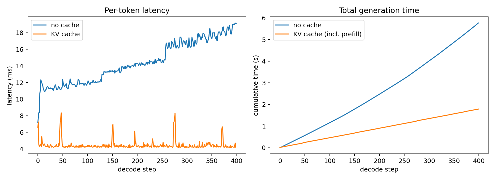

[📓 Google Colab Notebook](https://colab.research.google.com/github/maitreyasuin/blog/blob/main/notebooks/kv-cache/kv-cache.ipynb)

> **TL;DR** - Autoregressive generation re-runs the transformer over the *entire* prefix for every new token. Causal attention makes most of that work redundant: past tokens never look at future tokens, so their keys and values never change. Cache them, and each step processes **one token**. We build this from scratch on GPT-2, prove it's mathematically exact, break it in the three ways everyone breaks it, and measure a **1.4-3.2×** wall-clock speedup on a free Colab T4. Then we confront the two prices: the cache becomes the memory bottleneck of modern inference, and our simple implementation quietly copies gigabytes it already had.

*If you know attention already, skim to §3; if you build inference systems, §§5–8 are for you. Everything runs in [one Colab notebook](https://colab.research.google.com/github/maitreyasuin/blog/blob/main/notebooks/kv-cache/kv-cache.ipynb) on a free T4.*

## The whole post in one plot

Run GPT-2 in the most obvious generation loop - full forward pass over the whole sequence, every token - and time each step. Then turn the KV cache on and do it again.



Without the cache, the per-token latency is a rising line: token 400 costs visibly more than token 1, because each step reprocesses a longer prefix. With the cache, the line goes flat. Same model, same weights, same output tokens - provably the same, as we'll see - at a fraction of the cost.

The rest of this post is the why, the how, the three common bugs, and the bill.

## 1. The problem: generation is a loop that forgets it's a loop

A decoder-only LLM generates one token at a time. The naive loop:

```{python}
#| eval: false
tokens = prompt
for _ in range(max_new_tokens):
    logits = model(tokens)            # forward over the WHOLE sequence
    tokens = tokens + [sample(logits[-1])]
```

At step 1 we run the model over $t$ tokens. At step 2, over $t{+}1$ tokens - of which $t$ are *identical to what we just processed*. By step 500 we've pushed the first prompt token through the network 500 times and gotten the exact same intermediate results 500 times.

How expensive? For hidden size $d$ and sequence length $t$, one forward pass costs roughly $O(t \cdot d^2)$ in the linear layers (QKV projections + MLP) and $O(t^2 \cdot d)$ in attention. A single full-sequence forward is *quadratic* in length - the cubic term below appears only because the naive loop repeats that forward for prefixes of length $1, 2, \dots, n$:

$$\underbrace{\sum_{t=1}^{n} O(t d^2)}_{\text{linear layers}} + \underbrace{\sum_{t=1}^{n} O(t^2 d)}_{\text{attention}} \;=\; O(n^2 d^2) + O(n^3 d).$$

Two things to notice, because most explanations get the emphasis wrong:

- The attention term is *cubic* in generated length. That's the headline.
- But for realistic sizes ($n$ in the hundreds–thousands, $d$ in the thousands, so $n \lesssim d$), the **linear-layer term $O(n^2d^2)$ dominates the actual FLOP count**. The biggest practical waste isn't recomputing attention - it's re-running every MLP over the whole prefix, every step.

The KV cache eliminates the repeated *prefix* work in both terms. Note carefully what it doesn't do: the new token still attends over the full history, so cached decoding still costs $O(td)$ attention per step, $O(n^2 d)$ total - and generation still stays sequential, because token $t{+}1$ needs token $t$. The cache only removes redundancy. Totals:

$$O(n^2 d^2) + O(n^3 d) \;\longrightarrow\; O(n d^2) + O(n^2 d).$$

## 2. What decode actually needs: the math

Causal self-attention for token $t$ (single head, scale $1/\sqrt{d_h}$):

$$o_t = \sum_{j \le t} \mathrm{softmax}_j\!\left(\frac{q_t^\top k_j}{\sqrt{d_h}}\right) v_j
= \mathrm{softmax}\!\left(\frac{q_t K_{1:t}^\top}{\sqrt{d_h}}\right) V_{1:t}.$$

1. $o_t$ needs **$q_t$** - the query of the *current* token only.
2. $o_t$ needs **$K_{1:t}, V_{1:t}$** - keys and values of *all* tokens so far.
3. Because the mask is causal, $k_j$ and $v_j$ for $j < t$ were computed from a prefix that hasn't changed. **They are constants.** Recomputing them is pure waste.

So the algorithm rewrites itself: keep $K_{1:t-1}, V_{1:t-1}$ in memory; each step, run the network on **one token** - compute $q_t, k_t, v_t$, append $k_t, v_t$ to the cache, attend $q_t$ against the full cache. Per-step cost drops from $O(td^2 + t^2d)$ to $O(d^2 + td)$.

**Why not cache Q too?** Remember that past queries $q_{j<t}$ appear *nowhere* in any future step. A query is a search request - once token $t$'s attention row is computed, $q_t$ is dead. Causality means new tokens query the past; the past never queries the future. (In an encoder, where everyone attends to everyone and the sequence doesn't grow, none of this machinery applies. Caching is a *decoding* trick.)

```{mermaid}
flowchart LR
    subgraph step["decode step t"]
        x["x_t (1 token)"] --> qkv["W_qkv"]
        qkv --> q["q_t"]
        qkv --> k["k_t"]
        qkv --> v["v_t"]
    end
    style step fill:#e3f2fd,stroke:#90caf9,stroke-width:1px
    k -->|append| K[("K cache 1..t")]
    v -->|append| V[("V cache 1..t")]
    q --> att["attention: softmax(q_t·Kᵀ)·V"]
    K --> att
    V --> att
    att --> out["o_t → MLP → logits"]
```

**Figure 1. Cached decoding in one transformer layer.** The current token produces a fresh query, key, and value. The key and value are appended to the cache; the query attends over the entire cached prefix. Past queries are never stored - nothing ever asks for them again.

## 3. Build it: a minimal GPT-2 with a cache

We'll write a ~120-line GPT-2 that loads real pretrained weights from Hugging Face, with a `forward` that optionally consumes and returns per-layer caches. (Architecture and weight-porting follow the well-known nanoGPT pattern.) First, here are the symbols we'll use in the code and math:

| Symbol | Meaning | GPT-2 small | Where you'll see it |
|---|---|---|---|
| $B$ | batch size | 1 here | first dim of everything |
| $T$ | tokens in *this* forward call | prompt length, or **1** during decode | `x: (B, T, C)` |
| $C$ | embedding width | 768 | residual stream |
| $H$ | attention heads | 12 | `q,k,v: (B, H, T, D_h)` |
| $D_h$ | head dim $= C/H$ | 64 | last dim of q/k/v |
| `past` | tokens already cached | grows by $T$ each call | `cache: (B, H, past, D_h)` per layer, ×2 for K and V |

**Cell 1 - setup**

```{python}
#| eval: false
# GPU: Runtime → Change runtime type → T4
!pip -q install tiktoken transformers
import math, time, torch, torch.nn as nn, torch.nn.functional as F
from dataclasses import dataclass
torch.manual_seed(0)
device = "cuda"
print(torch.__version__, torch.version.cuda, torch.cuda.get_device_name())
```

**Cell 2 - the model**

```{python}
#| eval: false
@dataclass
class GPTConfig:
    block_size: int = 1024   # GPT-2 max context
    vocab_size: int = 50257
    n_layer: int = 12
    n_head: int = 12
    n_embd: int = 768

class CausalSelfAttention(nn.Module):
    def __init__(self, cfg):
        super().__init__()
        self.n_head = cfg.n_head
        self.c_attn = nn.Linear(cfg.n_embd, 3 * cfg.n_embd)  # fused QKV
        self.c_proj = nn.Linear(cfg.n_embd, cfg.n_embd)

    def forward(self, x, cache=None):
        B, T, C = x.shape
        # One linear layer produces Q, K, V together:
        #   x: (B, T, C) → qkv: (B, T, 3C) → split → q, k, v: each (B, T, C)
        q, k, v = self.c_attn(x).split(C, dim=2)
        # Reshape for multi-head attention: (B, T, C) → (B, H, T, D_h).
        # Heads become a batch-like dim so each head attends independently.
        q, k, v = (t.view(B, T, self.n_head, C // self.n_head).transpose(1, 2)
                   for t in (q, k, v))
        if cache is not None:
            # Decode: this call's k,v cover only the NEW T tokens.
            # Prepend history along the sequence dim (dim=2 in (B,H,T,D_h)).
            k_past, v_past = cache          # each (B, H, past, D_h)
            k = torch.cat([k_past, k], dim=2)   # (B, H, past+T, D_h)
            v = torch.cat([v_past, v], dim=2)
            # ^ Simple, correct, and secretly expensive - see §8.
        # Masking (the full story is §5, bug 2):
        #   prefill  → square T×T attention → causal mask ON
        #   decode   → 1 query vs past+1 keys → everything IS the past; no mask needed.
        # is_causal=True during decode is not just unnecessary - it's WRONG:
        # SDPA aligns non-square causal masks top-left, hiding nearly the whole cache.
        y = F.scaled_dot_product_attention(q, k, v, is_causal=(cache is None))
        # (B, H, T, D_h) → (B, T, H, D_h) → (B, T, C).
        # contiguous() because transpose changed strides and view() needs flat memory.
        y = y.transpose(1, 2).contiguous().view(B, T, C)
        return self.c_proj(y), (k, v)

class MLP(nn.Module):
    def __init__(self, cfg):
        super().__init__()
        self.c_fc   = nn.Linear(cfg.n_embd, 4 * cfg.n_embd)
        self.c_proj = nn.Linear(4 * cfg.n_embd, cfg.n_embd)
        self.act    = nn.GELU(approximate="tanh")   # GPT-2 uses tanh-GELU
    def forward(self, x):
        return self.c_proj(self.act(self.c_fc(x)))

class Block(nn.Module):
    def __init__(self, cfg):
        super().__init__()
        self.ln_1, self.attn = nn.LayerNorm(cfg.n_embd), CausalSelfAttention(cfg)
        self.ln_2, self.mlp  = nn.LayerNorm(cfg.n_embd), MLP(cfg)
    def forward(self, x, cache=None):
        a, cache = self.attn(self.ln_1(x), cache)
        x = x + a
        x = x + self.mlp(self.ln_2(x))
        return x, cache

class GPT(nn.Module):
    def __init__(self, cfg):
        super().__init__()
        self.config = cfg
        self.transformer = nn.ModuleDict(dict(
            wte = nn.Embedding(cfg.vocab_size, cfg.n_embd),
            wpe = nn.Embedding(cfg.block_size, cfg.n_embd),
            h   = nn.ModuleList(Block(cfg) for _ in range(cfg.n_layer)),
            ln_f= nn.LayerNorm(cfg.n_embd),
        ))
        self.lm_head = nn.Linear(cfg.n_embd, cfg.vocab_size, bias=False)
        self.lm_head.weight = self.transformer.wte.weight   # weight tying

    def forward(self, idx, caches=None):
        B, T = idx.shape
        # Every layer has cached the same number of tokens;
        # caches[0][0] is layer 0's key cache: (B, H, past, D_h) → read `past` off dim 2.
        past = 0 if caches is None else caches[0][0].size(2)
        assert past + T <= self.config.block_size
        # POSITION OFFSET - the #1 cache bug (§5): token t must get position
        # embedding t, not 0. During decode T=1, so without the offset every
        # generated token would sit at position 0.
        pos = torch.arange(past, past + T, device=idx.device)
        x = self.transformer.wte(idx) + self.transformer.wpe(pos)
        new_caches = []
        for i, block in enumerate(self.transformer.h):
            x, c = block(x, None if caches is None else caches[i])
            new_caches.append(c)
        x = self.transformer.ln_f(x)
        return self.lm_head(x), new_caches
```

**Cell 3 - load the real GPT-2 weights** (weight surgery; fold open if curious)

```{python}
#| eval: false
#| code-fold: true
@classmethod
def from_pretrained(cls):
    """Load HF GPT-2 (124M) weights into this implementation."""
    from transformers import GPT2LMHeadModel
    model = cls(GPTConfig())
    sd = model.state_dict()
    hf = GPT2LMHeadModel.from_pretrained("gpt2").state_dict()
    # HF stores these linear layers as Conv1D → weights are transposed
    transposed = ("attn.c_attn.weight", "attn.c_proj.weight",
                  "mlp.c_fc.weight", "mlp.c_proj.weight")
    with torch.no_grad():
        for k in hf:
            if k.endswith(".attn.masked_bias") or k.endswith(".attn.bias"):
                continue                      # causal-mask buffers, not params
            w = hf[k].t() if any(k.endswith(t) for t in transposed) else hf[k]
            sd[k].copy_(w)
    return model

GPT.from_pretrained = from_pretrained
model = GPT.from_pretrained().to(device).eval()
print(sum(p.numel() for p in model.parameters())/1e6, "M params")
```

**Cell 4 - two generation loops**

```{python}
#| eval: false
def timed(fn):
    torch.cuda.synchronize(); t0 = time.perf_counter()
    out = fn()
    torch.cuda.synchronize()
    return out, time.perf_counter() - t0

@torch.inference_mode()
def generate_no_cache(model, idx, max_new_tokens):
    """The naive loop: full forward over the whole sequence, every step."""
    per_step = []
    for _ in range(max_new_tokens):
        (logits, _), dt = timed(lambda: model(idx[:, -model.config.block_size:]))
        idx = torch.cat([idx, logits[:, -1].argmax(-1, keepdim=True)], dim=1)
        per_step.append(dt)
    return idx, per_step

@torch.inference_mode()
def generate_with_cache(model, idx, max_new_tokens):
    """Prefill once over the prompt, then feed ONE token per step."""
    per_step = []
    (logits, caches), t_prefill = timed(lambda: model(idx))       # PREFILL
    nxt = logits[:, -1].argmax(-1, keepdim=True)
    out = [idx, nxt]
    for _ in range(max_new_tokens - 1):                            # DECODE
        (logits, caches), dt = timed(lambda: model(nxt, caches))
        nxt = logits[:, -1].argmax(-1, keepdim=True)
        out.append(nxt)
        per_step.append(dt)
    return torch.cat(out, dim=1), per_step, t_prefill
```

(`inference_mode` rather than `no_grad`: it additionally disables autograd's version tracking on tensors - marginally faster, and nothing here will ever backprop.)

## 4. Correctness first: the cache must be *exact*

The KV cache is not an approximation, and we can say precisely why.

**Proof sketch.** Assume eval mode, no dropout. In a decoder-only transformer, the causal mask guarantees that the layer-$\ell$ representation of position $j$ depends only on tokens $1..j$ - so appending token $t$ cannot change any representation at positions $< t$. Now compare full-prefix execution (forward over $1..t$) with cached execution (forward over $1..t{-}1$, store every layer's $K,V$, then forward token $t$ alone). At layer $\ell$: the current token's query $q_t^\ell$ is computed from the same hidden state in both executions; the past keys and values are identical because the past hidden states are; the new $k_t^\ell, v_t^\ell$ come from the same current hidden state. So token $t$'s attention row is identical, and since LayerNorm and the MLP act position-wise, its layer output is too. Induct over layers, then over decode steps: **cached greedy decoding produces the same logits as full recomputation** - up to floating-point kernel differences, which is the one honest caveat: the two paths hit different kernels with different summation orders, so in fp16 the logits can differ in the last bits, and after a near-tie in argmax that can flip a token. Same math, different rounding. Run correctness checks in fp32.

Two tests, in increasing strictness of what they catch:

**Cell 5a - logit-level check** (catches numerical drift that token equality can hide behind argmax):

```{python}
#| eval: false
@torch.inference_mode()
def assert_cached_logits_match(model, prompt):
    logits_full, caches = model(prompt)                     # prefill
    nxt = logits_full[:, -1].argmax(-1, keepdim=True)
    logits_ref, _ = model(torch.cat([prompt, nxt], dim=1))  # recompute from scratch
    logits_inc, _ = model(nxt, caches)                      # one cached step
    torch.testing.assert_close(logits_inc[:, -1], logits_ref[:, -1],
                               rtol=1e-5, atol=1e-5)
    print("logit exactness ✓")


model_fp32 = model.float()
assert_cached_logits_match(model_fp32, prompt)
# logit exactness ✓
```

**Cell 5b - 100-token integration check** (catches everything else):

```{python}
#| eval: false
a, _     = generate_no_cache(model_fp32, prompt.clone(), 100)
b, _, _  = generate_with_cache(model_fp32, prompt.clone(), 100)
assert torch.equal(a, b), "cache changed the output!"
print("greedy exactness ✓ :", enc.decode(a[0].tolist())[:120], "...")
# greedy exactness ✓ : The key to fast inference is to know what the data is about.

# The first thing to know is that the data is not a single p ...
```

## 5. Break it: the three common bugs

Let's write the common bugs deliberately - each one below is a real mistake I've made or reviewed, each has a distinctive failure signature, and each is a one-line fix once you can name it.

### Bug 1 - positions: the fluent-garbage generator

With a cache, step $t$ feeds the model a tensor of shape `(B, 1)`. Compute positions as `arange(T)` and every generated token gets embedded at position 0. GPT-2's learned absolute embeddings make this catastrophic *and* silent - the model produces grammatical text that slowly stops making sense, which is the worst kind of bug: nothing crashes.

```{python}
#| eval: false
class PositionBuggyGPT(GPT):
    """The bug, isolated: positions restart at 0 every forward call."""
    def forward(self, idx, caches=None):
        B, T = idx.shape
        past = 0 if caches is None else caches[0][0].size(2)
        pos = torch.arange(0, T, device=idx.device)          # ← BUG: no offset
        x = self.transformer.wte(idx) + self.transformer.wpe(pos)
        new_caches = []
        for i, block in enumerate(self.transformer.h):
            x, c = block(x, None if caches is None else caches[i])
            new_caches.append(c)
        return self.lm_head(self.transformer.ln_f(x)), new_caches

buggy = PositionBuggyGPT(GPTConfig()).to(device).float().eval()
buggy.load_state_dict(model_fp32.state_dict())

a, _    = generate_no_cache(buggy, prompt.clone(), 40)       # no cache → bug dormant
b, _, _ = generate_with_cache(buggy, prompt.clone(), 40)     # cached  → bug live
print("outputs equal?", torch.equal(a, b))                   # False
print("no cache:", enc.decode(a[0].tolist()))
print("cached  :", enc.decode(b[0].tolist()))                # fluent, then unmoored
# outputs equal? False
# no cache: The key to fast inference is to know what the data is about.

# The first thing to know is that the data is not a single point. It is a collection of points.

# The second thing to know is
# cached  : The key to fast inference is to the the,,,,,,,,,,,,,,,,,,,,,,,,,,,,,,,,,,,,,
```

Note *when* the bug fires: the no-cache path is immune (its `arange(T)` is accidentally correct because $T$ is always the full length). The bug only exists on the cached path - which is why the §4 equality test is the right detector, and why "it works without the cache" proves nothing. RoPE models have the same bug in rotary-phase clothing: rotate $q_t, k_t$ by angle 0 instead of angle $t$.

### Bug 2 - masking: the model that can only see its first token

During prefill you attend over a square $T \times T$ block and need the causal mask. During cached decode the query attends over `past+1` keys, *all of which are legitimately in its past* - the "mask" is the cache boundary itself. Keeping `is_causal=True` feels harmlessly conservative. It isn't:

```{python}
#| eval: false
B, H, past, Dh = 1, 12, 64, 64
q = torch.randn(B, H, 1, Dh, device=device)          # one decode query
k = torch.randn(B, H, past + 1, Dh, device=device)   # full cache
v = torch.randn(B, H, past + 1, Dh, device=device)

right = F.scaled_dot_product_attention(q, k, v, is_causal=False)
wrong = F.scaled_dot_product_attention(q, k, v, is_causal=True)

# What did the wrong one compute? Attention to ONLY the first key:
only_first = v[:, :, :1, :]
print((wrong - only_first).abs().max().item())   # ~0  ← it ignored 64 of 65 keys
print((right - wrong).abs().max().item())        # large
# 0.0
# 3.039318561553955
```

The mechanism: for non-square shapes, SDPA aligns the causal mask to the **top-left** - query row 0 may attend to key column 0, full stop. Your one query gets matched against the *first* cache entry and the other 64 are masked away. The model can only see the first token it ever read. Hence the line in our implementation: `is_causal=(cache is None)`.

### Bug 3 - batching + padding: deferred, deliberately

For this simple generation loop, left-padding is the easiest correct choice, because `logits[:, -1]` then corresponds to the last real token for every sequence. Right-padding can also be made correct, but then you must gather each sequence’s last non-padding logits, maintain per-sequence position offsets, and ensure padding K/V entries are masked out. We dodge all of this with batch = 1 here.

## 6. Measure it: benchmarks on a free T4

**Cell 6 - the race**

```{python}
#| eval: false
model = model.half().eval()
print(torch.__version__, torch.version.cuda, torch.cuda.get_device_name())

def reset_mem():  torch.cuda.empty_cache(); torch.cuda.reset_peak_memory_stats()
def peak_mb():    return torch.cuda.max_memory_allocated() / 2**20

for _ in range(3):                                   # warmup: CUDA context, kernels, allocator
    generate_with_cache(model, torch.randint(0, 50257, (1, 128), device=device), 16)

rows = []
for plen in (16, 128, 512):
    prompt = torch.randint(0, 50257, (1, plen), device=device)
    n_new = 400 if plen <= 128 else 400              # keep plen+n_new < 1024
    reset_mem(); _, steps_nc      = generate_no_cache(model, prompt.clone(), n_new)
    reset_mem(); _, steps_c, tp   = generate_with_cache(model, prompt.clone(), n_new); mem_c = peak_mb()
    rows.append((plen, n_new, sum(steps_nc), tp + sum(steps_c),
                 sum(steps_nc)/(tp + sum(steps_c)), 1e3*sum(steps_c)/len(steps_c), mem_c))
for r in rows: print(r)
```

| Prompt | New tokens | No-cache total | Cache total (incl. prefill) | Speedup | Cached TPOT | Peak mem |
|---|---|---|---|---|---|---|
| 16 | 400 | 2.52 s | 1.84 s | 1.37× | 4.60 ms | 769.63 MiB |
| 128 | 400 | 2.98 s | 2.14 s | 1.39× | 5.35 ms | 777.50 MiB |
| 512 | 400 | 5.76 s | 1.78 s | 3.22× | 4.45 ms | 835.24 MiB |

Expect the speedup to *grow* with prompt length - exactly what the $O(n^2d^2) \to O(nd^2)$ analysis predicts.

*Note that Colab timings are noisy, so better to take median over multiple runs than to trust a single run*.

**Cell 7 - the money plot** (note the cached cumulative curve includes the prefill, so both curves are honest end-to-end time):

```{python}
#| eval: false
import numpy as np, matplotlib.pyplot as plt
fig, ax = plt.subplots(1, 2, figsize=(11, 4))
ax[0].plot([t*1e3 for t in steps_nc], label="no cache")
ax[0].plot([t*1e3 for t in steps_c],  label="KV cache")
ax[0].set(xlabel="decode step", ylabel="latency (ms)", title="Per-token latency")
ax[0].legend()
ax[1].plot(np.cumsum(steps_nc),              label="no cache")
ax[1].plot(np.cumsum([tp] + steps_c),        label="KV cache (incl. prefill)")
ax[1].set(xlabel="decode step", ylabel="cumulative time (s)", title="Total generation time")
ax[1].legend(); plt.tight_layout(); plt.savefig("latency.png", dpi=180)
```


**Why is the cached line flat - and would it stay flat?** Honest answer: it's flat *at this scale*, not in principle. A cached step costs $O(d^2)$ for weights plus $O(t \cdot d)$ for attending over the cache. At GPT-2 size ($d{=}768$, $t \le 1024$) the weight term towers over the cache term, so growth is invisible. Push to a 7B model at 128k context and the ratio inverts: reading the cache *is* the step, per-token latency climbs with context, and we will realize why decode-specialized kernels (Flash-Decoding) and cache-compression schemes exist.

## 7. The bill: the cache is memory you now have to plan for

Per token, per sequence, the cache stores one K and one V vector per layer per KV-head:

$$\text{bytes/token} = 2 \times n_{\text{layers}} \times n_{\text{kv-heads}} \times d_{\text{head}} \times \text{bytes}_{\text{dtype}}$$

| Model | Layers | KV heads × d_head | KiB / token (fp16) | 8k context | 128k context |
|---|---|---|---|---|---|
| GPT-2 124M | 12 | 12×64 (MHA) | 36 | 0.29 GiB | - (ctx 1k) |
| Llama-2-7B | 32 | 32×128 (MHA) | 512 | 4.0 GiB | - |
| Llama-3.1-8B | 32 | 8×128 (GQA) | 128 | 1.0 GiB | **16 GiB** |
| Llama-3.1-70B | 80 | 8×128 (GQA) | 320 | 2.5 GiB | **40 GiB** |

*The cache is not a model property; it's a **model × sequence length × batch size** property. At batch 32, the Llama-3.1-8B 128k row becomes $32 \times 16 = 512$ GiB, before weights, activations, or allocator overhead.*

There are a few ways to address this, such as **MQA / GQA** (1 or few KV heads shared across query heads), **MLA** (DeepSeek, store a small latent), **quantized / windowed caches**, and **PagedAttention** (vLLM). We will cover some of these in future parts of this series.

## 8. The uncomfortable truth: our cache is correct, and still bad

We proved exactness and measured a big speedup. Time to disappoint ourselves. This line -

```{python}
#| eval: false
k = torch.cat([k_past, k], dim=2)
```

allocates a brand-new tensor and copies the *entire old cache* into it, every layer, every step. The step-$t$ copy moves $\sim t \times$ 36 KiB; summed over a generation from $n_0$ to $n_1$ tokens the total memcpy is roughly

$$\text{bytes copied} \;\approx\; \text{bytes/token} \times \frac{n_1^2 - n_0^2}{2},$$

which for our 128-prompt, 400-token benchmark is $36{,}864 \times (528^2 - 128^2)/2 \approx$ **4.5 GiB of data the GPU already had**.

It's *fine here* - GPT-2 is small and the T4 shrugs. An improved version preallocates once and writes each new token into its slot:

```{python}
#| eval: false
class StaticLayerKVCache:
    """Preallocated KV cache for one layer - no torch.cat, no reallocation.
    This is Hugging Face's StaticCache in miniature.
    k/v storage: (B, H, max_len, D_h); `pos` is the write pointer."""
    def __init__(self, B, H, max_len, Dh, dtype, device):
        self.k = torch.empty(B, H, max_len, Dh, dtype=dtype, device=device)
        self.v = torch.empty_like(self.k)
        self.pos = 0

    def append(self, k_new, v_new):
        """k_new, v_new: (B, H, T_new, Dh). T_new=1 in decode, =prompt_len in prefill.
        Returns views of the valid prefix - zero copy of history."""
        t = k_new.size(2); end = self.pos + t
        if end > self.k.size(2):
            raise RuntimeError(f"KV cache overflow: need {end}, capacity {self.k.size(2)}")
        self.k[:, :, self.pos:end].copy_(k_new)
        self.v[:, :, self.pos:end].copy_(v_new)
        self.pos = end
        return self.k[:, :, :end], self.v[:, :, :end]
```

The win is bigger than avoided copies. A static cache means **static shapes**, and static shapes are what let production stacks capture the whole decode step as a **CUDA graph** (`torch.compile(mode="reduce-overhead")` does this for you): the CPU stops launching hundreds of kernels per token and replays one recorded graph, which at small batch sizes is often worth more than any single kernel optimization. Dynamic `torch.cat` shapes forbid all of that. Hugging Face's `model.generate(..., use_cache=True)` uses something very similar to the loop we wrote.

We now have a model that generates efficiently for *one* sequence, a proof that the optimization is free, three common bugs, and a cache whose size we can predict to the byte. In future articles, we'll explore why materializing the $T\times T$ score matrix is the real crime of prefill, and how FlashAttention computes exact attention without ever writing it down.

*Feel free to reach out to me for any comments or thoughts: maitreyasuin21 [at] gmail [dot] com*

## References & further reading

**Papers**

- Vaswani et al., [*Attention Is All You Need*](https://arxiv.org/abs/1706.03762), 2017 - the $O(n^2)$ we're taming.
- Shazeer, [*Fast Transformer Decoding: One Write-Head Is All You Need*](https://arxiv.org/abs/1911.02150) (MQA), 2019.
- Ainslie et al., [*GQA: Training Generalized Multi-Query Transformer Models*](https://arxiv.org/abs/2305.13245), 2023.
- DeepSeek-AI, [*DeepSeek-V2*](https://arxiv.org/abs/2405.04434) (introduces MLA), 2024.
- Kwon et al., [*Efficient Memory Management for LLM Serving with PagedAttention*](https://arxiv.org/abs/2309.06180).

**Docs & code**

- [Hugging Face: KV cache strategies](https://huggingface.co/docs/transformers/en/cache_explanation) (`DynamicCache`, `StaticCache`, `past_key_values`).
- [PyTorch: `scaled_dot_product_attention`](https://pytorch.org/docs/stable/generated/torch.nn.functional.scaled_dot_product_attention.html) - the fine print behind bug 2's mask alignment.
- [kipply, *Transformer Inference Arithmetic*](https://kipply.com/blog/transformer-inference-arithmetic/), 2022.
- [Karpathy, *nanoGPT*](https://github.com/karpathy/nanoGPT) - the architecture and weight-loading pattern used here.
- [vLLM documentation](https://docs.vllm.ai/) - PagedAttention, continuous batching, prefix caching: Part 3's syllabus.
